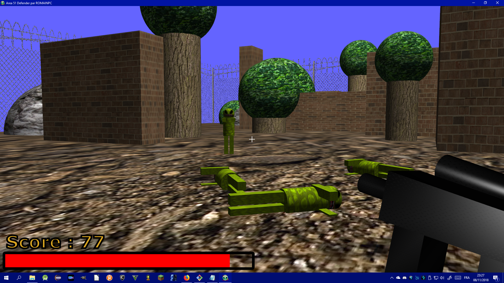

# Area-51-defender
FPS singleplayer en JavaFX

 

## Prérequis :
- Java version 8 minimum (pour avoir la librairie JavaFX)
	https://www.java.com/fr/

## Optimisation (ou si le jeu ne démarre pas):

- Ouvrez le bloc note windows

- Tapez: java -Xms1g -Xmx4g -jar "C:/chemin/de/votre/fichier/Area 51 Defender.exe"
	(essayez différentes valeurs autre que 1 et 4)

- Enregistrer sous

- Tout types de fichier

- Enregistrer ce petit code n'importe où EN RAJOUTANT .bat (ex: Lanceur du jeu.bat)

- Double cliquez sur le fichier .bat créé pour lancer le Jeu.
